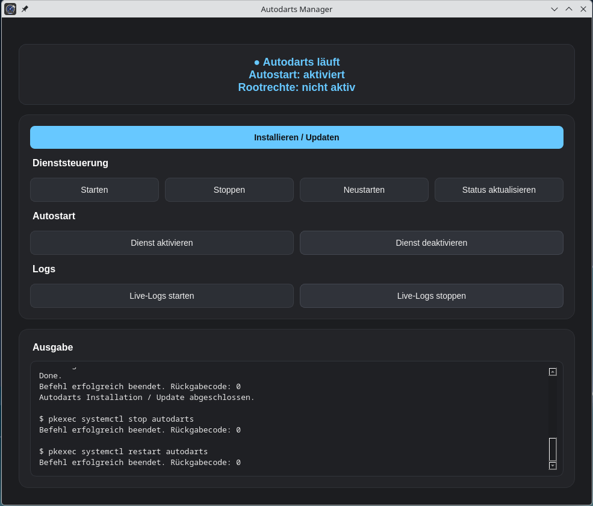

# Autodarts Manager

A simple and modern Linux desktop manager for Autodarts.

The Autodarts Manager provides a graphical interface to install, update and manage the Autodarts service on Linux systems.



## Features

- Install or update Autodarts
- Start the Autodarts service
- Stop the Autodarts service
- Restart the Autodarts service
- Enable Autodarts autostart
- Disable Autodarts autostart
- Show live logs with `journalctl`
- Modern dark PySide6 interface
- Works on Manjaro and other common Linux distributions

## Installation on Manjaro / Arch Linux

The recommended installation method on Manjaro or Arch-based systems is via AUR:

```bash
yay -S autodarts-manager-bin

## License

This project is licensed under the MIT License.
